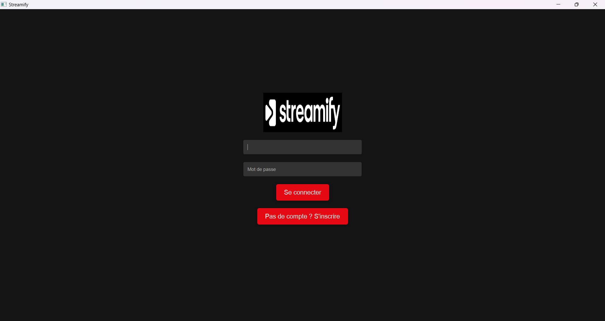
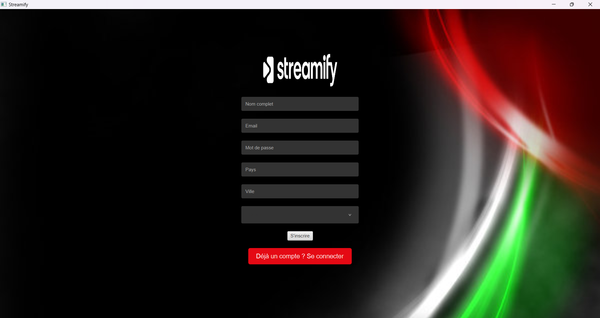
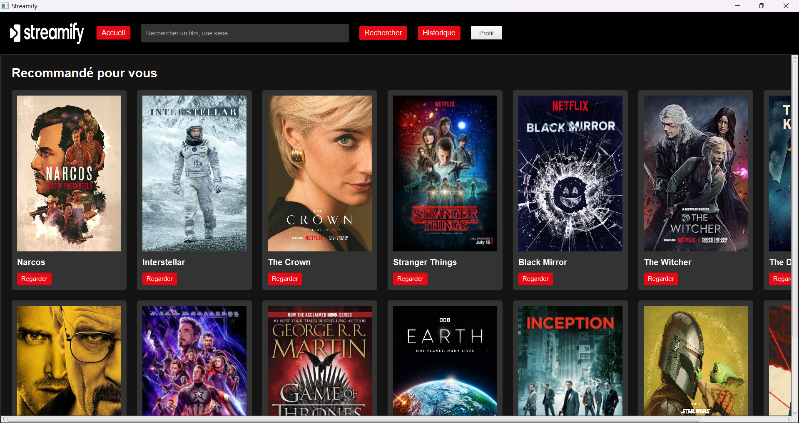

# Streamify

Streamify est une application de streaming en JavaFX qui permet aux utilisateurs de regarder des films, des séries et des documentaires.

## Fonctionnalités
- Connexion et inscription des utilisateurs.
- Affichage des contenus disponibles.
- Lecture des vidéos via YouTube.
- Sauvegarde de l'historique de visionnage.
- Sauvegarde des abonnements dans un fichier binaire ( Serialisation )

## Comment exécuter le projet
1. Clonez ce dépôt.
2. Ouvrez le projet dans IntelliJ ou Eclipse.
3. Configurez la base de données MySQL (voir `DatabaseHandler.java`).
4. Exécutez `Main.java`.

## Captures d'écran

